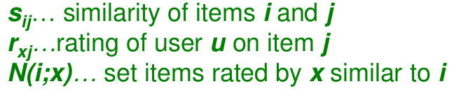
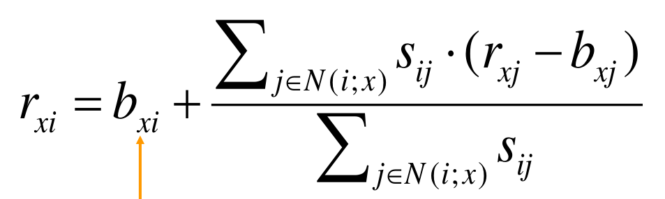
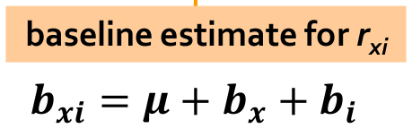

# RECSYS
Implementation of various popular Collaborative Filtering algorithms in Python.

Course Assignment for CS F469- Information Retrieval @ BITS Pilani, Hyderabad Campus.

**Done under the guidance of Dr. Aruna Malapati, Assistant Professor, BITS Pilani, Hyderabad Campus.**

## Table of Contents
* [Instructions to run the scripts](#instructions-to-run-the-scripts)
      * [Create the train matrix and the mappings](#create-the-train-matrix-and-the-mappings)
      * [Collaborative Filtering](#collaborative-filtering)
      * [Collaborative Filtering with Baseline Approach](#collaborative-filtering-with-baseline-approach)
      * [SVD](#svd)
      * [CUR](#cur)
* [Introduction](#introduction)
* [Data](#data)
* [Directory Structure:](#directory-structure-)
* [Vanilla Collaborative Filtering](#vanilla-collaborative-filtering)
* [Collaborative Filtering with baseline](#collaborative-filtering-with-baseline)
- [SVD](#svd-1)
* [CUR](#cur-1)
* [Machine specs:](#machine-specs-)
* [Results](#results)
* [Members](#members)

<small><i><a href='http://ecotrust-canada.github.io/markdown-toc/'>Table of contents generated with markdown-toc</a></i></small>


<small><i><a href='http://ecotrust-canada.github.io/markdown-toc/'>Table of contents generated with markdown-toc</a></i></small>

<small><i><a href='http://ecotrust-canada.github.io/markdown-toc/'>Table of contents generated with markdown-toc</a></i></small>

## Instructions to run the scripts
Run the following commands for the various implementations of collaborative filtering:

##### Create the train matrix and the mappings
```python
python create_matrices.py
```
##### Collaborative Filtering
```python
python collabortive_filtering.py
```
##### Collaborative Filtering with Baseline Approach
```
python collaborative_filtering_withbaseline.py 
```
##### SVD
```python
python SVD.py
```
##### CUR
```python
python CUR.py
```
## Introduction
Collaborative filtering is a method of making automatic predictions (filtering) about the interests of a user by collecting preferences or taste information from many users (collaborating). The main purpose of this project is understand how the following collaborative filtering algorithms work-
1. Vanilla Approach
2. Baseline Approach
3. SVD Decomposition Approach
4. CUR Decomposition Approach

*More on [Collaborative Filtering](https://en.wikipedia.org/wiki/Collaborative_filtering).*

## Data
We used the MovieLens 1M dataset, which can be found [here](https://grouplens.org/datasets/movielens/). The dataset contains *1 million* ratings from 6000 users on 4000 movies. The ratings range from 1 to 5, with zeroes indicating missing ratings. The data can be found in the folder *data*.

The data was shuffled and then split to create train(80%) and test(20%) sets.

|                 | Ratings | Unique users | Unique movies |
|-----------------|---------|--------------|---------------|
| Overall Dataset | 1000209 | 6040         | 3706          |
| Train Set (80%) | 800167  | 6040         | 3682          |
| Test Set (20%)  | 200041  | 6036         | 3462          |

## Directory Structure:

```python
recsys_final/
+-- data
|   +-- ratings.dat (original data file containing ratings)
+-- temp_data
|   +-- movie_map.pkl (movie_map in pickled format) 
|   +-- sigma.npy (numpy file containing sigma matrix in dense representation)
|   +-- test_table.pkl (pickled pandas dataframe conaining the test data) 
|   +-- train.npz (numpy file containing the train matrix in sparse representation) 
|   +-- U.npy (numpy file containing U matrix in dense representation)
|   +-- user_map.pkl (user_map in pickled format)
|   +-- V_t.npy (numpy file containing transpose of V matrix in dense representation)
+--  create_matrices.py(python script to create read the data, adn create train matrix, test dataframe and user and movie mappings and save them to disk)
+-- collaborative_filtering.py(python script to perform collaborative filtering)
+--  CUR.py(python script to perform collaborative filtering using CUR decomposition)
+--  evaluation.py (python script containing functions for evaluation metrics)
+--  SVD_module.py (python script to perform collaborative filtering using SVD)
+--  recsys_utils.py (python script containing functions for loading matrices and mappings) 
```

## Vanilla Collaborative Filtering




While predicting rating, the ratings of the 10 most similar users are used.

## Collaborative Filtering with baseline




## SVD
No. of singular values retained= 1088 (90% energy)

## CUR
No. of columns and rows retained= 900

## Machine specs:
Processor: i7-7500U
Ram: 16 GB DDR4
OS: Ubuntu 16.04 LTS

## Results

| Recommender System Technique               | Root Mean Square Error (RMSE) | Precision on top K       | Spearman Rank Correlation                  | Time taken for prediction (secs) |
|--------------------------------------------|-------------------------------|--------------------------|--------------------------------------------|----------------------------------|
| Collaborative                              | 2.0335 (item)    2.150 (user) | 1.0 (item)    1.0 (user) | 0.9999997518 (item)    0.9999997225 (user) | 235.44 (item)    291.091 (user)  |
| Collaborative along with Baseline approach |                               |                          |                                            |                                  |
| SVD                                        | 1.03512426007                 | 0.654428981666           | 0.999999999839                             | 565.33                           |
| SVD with 90% retained energy               | 1.03                          | 0.6528                   | 0.999999999839                             | 361.49                           |
| CUR                                        |                               |                          |                                            |                                  |
| CUR with 90% retained energy               |                               |                          |                                            |                                  |
                                 |

## Members
[Shubham Jha](http://github.com/shubhamjha97)

[Praneet Mehta](http://github.com/praneetmehta)

[Abhinav Jain](http://github.com/abhinav1112)

[Saurabh Khandelwal](http://github.com/stgstg27)


# TO ADD
Results
SVD, CUR no. of values retained
formulae